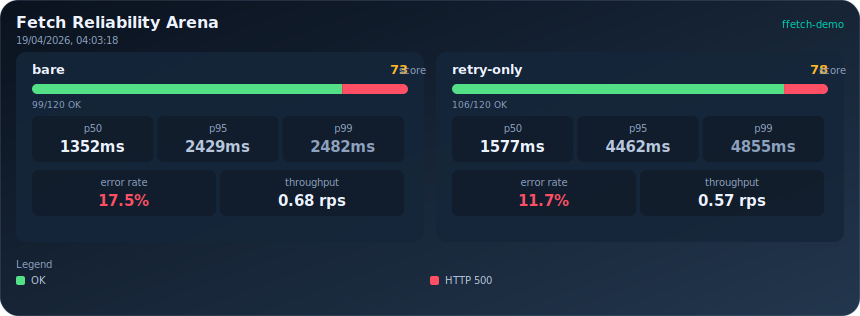
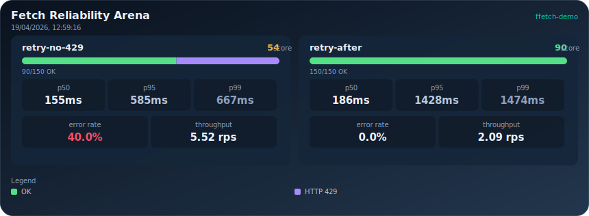
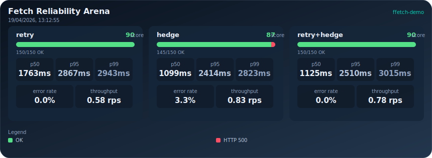

# 你的 HTTP 客户端在欺骗你

> 原文: [Your HTTP Client Is Lying to You](https://blog.gaborkoos.com/posts/2026-04-19-Your-HTTP-Client-Is-Lying-to-You/)
> 作者: Gabor Koos | 2026年4月19日

如果你写前端或 Node.js 代码足够久，最终你会遇到同样的可靠性困境：网络在本地测试时没问题，到了生产环境就会出现延迟尖峰、偶发 5xx 响应、速率限制，以及只在负载下才显现的奇怪计时行为。

通常的应对方式是加固客户端：增加重试、调整超时。也许再加个[断路器](https://blog.gaborkoos.com/posts/2025-09-17-Stop-Hammering-Broken-APIs-the-Circuit-Breaker-Pattern/)来防止级联故障。或者你之后再加个[对冲请求](https://mintlify.wiki/App-vNext/Polly/strategies/hedging)来改善 p99 延迟。理论上，这些每一项都是最佳实践。这些技术的温和介绍可以在[这里](https://www.freecodecamp.org/news/how-to-go-from-toy-api-calls-to-production-ready-networking-in-javascript/)找到，涵盖了核心模式、如何配置以及何时使用。

但在实践中，这些模式可能以令人惊讶的方式相互影响。有时它们有帮助，有时它们会悄无声息地让延迟和可靠性变得更糟。为了说明这一点，我们将在现实的混沌条件下运行几个受控实验。这里的目标不是深入分析，只是一次简短、实用的巡览，展示我在运行受控混沌场景时观察到的几个反直觉结果，外加一些关于下一步该调整什么的实用指南。

---

## 欢迎来到竞技场

我们将使用 [ffetch-demo](https://fetch-kit.github.io/ffetch-demo/)，一个基于浏览器的混沌竞技场。它最初是为了在相同网络条件下比较不同的 HTTP 客户端而构建的，同时也是一个很好的沙盒，可以用相同的合成网络混沌混合来测试不同的弹性模式和配置。我们通过向传输层添加混沌规则（延迟、随机故障、速率限制等）来定义网络行为，然后对使用预定义 HTTP 客户端集合的测试端点运行可重复的工作负载，并排比较可靠性评分、错误模式和延迟。混沌既是确定性和可重复的，也是在配置范围内随机化的，因此你可以看到不同模式在相同条件下的表现，但具体数字会有一些变化。目标是展示方向性趋势和权衡，而不是精确值。

结果展示了响应时间分布、错误率、可靠性评分以及 p95 延迟和成功次数等几个关键指标。我们将使用不同的客户端配置和混沌混合运行几个场景，看看这些模式在实践中如何相互作用。

可靠性评分是一个高层次健康指标，它将请求成功和延迟质量结合为一个数字，因此越高通常意味着客户端在负载下既更常成功，也表现更好。

---

## 场景 A：在严格超时下重试可能恶化尾部延迟

让我们看看[以下设置](http://fetch-kit.github.io/ffetch-demo/#url=https%3A%2F%2Fjsonplaceholder.typicode.com%2Fposts%2F1&count=120&conc=15&chaos64=W3sidHlwZSI6ImxhdGVuY3lSYW5nZSIsIm1pbk1zIjoyMDAsIm1heE1zIjoyNTAwfSx7InR5cGUiOiJmYWlsUmFuZG9tbHkiLCJyYXRlIjowLjE1LCJzdGF0dXMiOjUwMCwiYm9keSI6IlNlcnZpY2UgZGVncmFkZWQifV0=&clients64=W3siaWQiOiJmZmV0Y2gtYmFyZSIsInR5cGUiOiJmZmV0Y2giLCJsYWJlbCI6ImJhcmUiLCJjb25maWciOnsiZW5hYmxlZCI6dHJ1ZSwidGltZW91dE1zIjozMDAwLCJyZXRyaWVzIjowLCJyZXRyeURlbGF5TW9kZSI6ImZpeGVkIiwicmV0cnlEZWxheU1zIjoyMDAsInJldHJ5Sml0dGVyTXMiOjEwMCwicmV0cnlTdGF0dXNDb2RlcyI6WzQyOSw1MDAsMzAyLDUwMiw1MDMsNTA0XSwicmV0cnlBZnRlclN0YXR1c0NvZGVzIjpbNDEzLDQyOSw1MDNdLCJ0aHJvd09uSHR0cEVycm9yIjpmYWxzZSwidXNlRGVkdXBlUGx1Z2luIjpmYWxzZSwiZGVkdXBlVHRsTXMiOjMwMDAwLCJkZWR1cGVTd2VlcEludGVydmFsTXMiOjUwMDAsInVzZUNpcmN1aXRQbHVnaW4iOmZhbHNlLCJjaXJjdWl0VGhyZXNob2xkIjo1LCJjaXJjdWl0UmVzZXRNcyI6MTAwMDAsImNpcmN1aXRPcmRlciI6MjAsImRlZHVwZU9yZGVyIjoxMCwidXNlSGVkZ2VQbHVnaW4iOmZhbHNlLCJoZWRnZURlbGF5TXMiOjUwLCJoZWRnZU1heEhlZGdlcyI6MSwiaGVkZ2VPcmRlciI6MTV9fSx7ImlkIjoiZmZldGNoLXJldHJ5IiwidHlwZSI6ImZmZXRjaCIsImxhYmVsIjoicmV0cnktb25seSIsImNvbmZpZyI6eyJlbmFibGVkIjp0cnVlLCJ0aW1lb3V0TXMiOjMwMDAsInJldHJpZXMiOjIsInJldHJ5RGVsYXlNb2RlIjoiZXhwby1qaXR0ZXIiLCJyZXRyeURlbGF5TXMiOjIwMCwicmV0cnlKaXR0ZXJNcyI6MTAwLCJyZXRyeVN0YXR1c0NvZGVzIjpbNDI5LDUwMCw1MDIsNTAzLDUwNF0sInJldHJ5QWZ0ZXJTdGF0dXNDb2RlcyI6WzQxMyw0MjksNTAzXSwidGhyb3dPbkh0dHBFcnJvciI6ZmFsc2UsInVzZURlZHVwZVBsdWdpbiI6ZmFsc2UsImRlZHVwZVR0bE1zIjozMDAwMCwiZGVkdXBlU3dlZXBJbnRlcnZhbE1zIjo1MDAwLCJ1c2VDaXJjdWl0UGx1Z2luIjpmYWxzZSwiY2lyY3VpdFRocmVzaG9sZCI6NSwiY2lyY3VpdFJlc2V0TXMiOjEwMDAwLCJjaXJjdWl0T3JkZXIiOjIwLCJkZWR1cGVPcmRlciI6MTAsInVzZUhlZGdlUGx1Z2luIjpmYWxzZSwiaGVkZ2VEZWxheU1zIjo1MCwiaGVkZ2VNYXhIZWRnZXMiOjEsImhlZGdlT3JkZXIiOjE1fX1d)：

如果你点击混沌规则卡片，可以看到配置的混沌混合：200ms 到 2500ms 之间的可变延迟，以及 15% 概率的随机 500 错误。我们定义了两个客户端：一个没有重试的裸客户端，和一个只有重试的客户端（2 次重试、200ms 重试延迟、3000ms 超时预算——重试只会重试失败的请求最多 2 次，但如果总时间超过 3000ms，它会放弃并返回错误）。在本文中，我们将使用 [`ffetch`](https://www.npmjs.com/package/@fetchkit/ffetch) 客户端，因为它内置了我们讨论的所有功能（原生 `fetch` 没有任何这些功能，[`axios`](https://www.npmjs.com/package/axios) 和 [`ky`](https://www.npmjs.com/package/ky) 有一些，但不是全部）。

我们将工具配置为发送 120 个请求，并发数为 15，这意味着它会尝试始终保持 15 个请求在途中，直到达到总共 120 个请求。竞技场对两个客户端应用相同的混沌规则，因此它们在完全相同的条件下被测试。点击 **Run Arena** 按钮，等待结果出来。使用 Download Card 按钮，你可以以 svg 格式导出结果：

这次运行展示了一个经典的可靠性 vs 延迟权衡：仅重试客户端改善了结果，但在失败方面只是适度改善，而尾部却变得糟糕得多。在这次运行中，成功从 99/120 提高到 106/120，错误率从 17.5% 改善到 11.7%。与此同时，p95 从 2429ms 飙升到 4462ms，p99 从 2482ms 飙升到 4855ms。换句话说，失败的请求少了那么一点点，但最慢的请求却变得极其缓慢。

这是否算赢取决于端点。对于后台处理、定时同步任务或内部工具，这种权衡通常是合理的，因为最终成功比响应速度更重要。对于面向用户的路径，如结账、搜索或任何扇出工作流（一个慢依赖会延迟整个响应），即使错误率改善了，这也可能是不可接受的。实际决策是端点特定的：你愿意为了多恢复那几个成功请求而支付 p95 和 p99 延迟成本吗？

重试绝对不坏，但也不是银弹。如果你的超时预算很紧，且端点具有高延迟方差，重试可能会让尾部延迟更糟，而成功率的提升却很有限。在这种情况下，你可能需要调整重试延迟、减少重试次数，或者考虑其他模式如对冲请求。

---

## 场景 B：在速率限制下，Retry-After 胜过盲目重试

在我们的[下一个设置](http://fetch-kit.github.io/ffetch-demo/#url=https%3A%2F%2Fjsonplaceholder.typicode.com%2Fposts%2F1&count=150&conc=10&preset=api-instability&chaos64=W3sidHlwZSI6ImxhdGVuY3lSYW5nZSIsIm1pbk1zIjo1MCwibWF4TXMiOjIwMH0seyJ0eXBlIjoicmF0ZUxpbWl0IiwibGltaXQiOjMwLCJ3aW5kb3dNcyI6MTAwMCwicmV0cnlBZnRlck1zIjo2MDB9XQ&clients64=W3siaWQiOiJmZmV0Y2gtbm80MjkiLCJ0eXBlIjoiZmZldGNoIiwibGFiZWwiOiJyZXRyeS1uby00MjkiLCJjb25maWciOnsiZW5hYmxlZCI6dHJ1ZSwidGltZW91dE1zIjozMDAwLCJyZXRyaWVzIjozLCJyZXRyeURlbGF5TW9kZSI6ImV4cG8taml0dGVyIiwicmV0cnlEZWxheU1zIjoyMDAsInJldHJ5Sml0dGVyTXMiOjEwMCwicmV0cnlTdGF0dXNDb2RlcyI6WzUwMCw1MDIsNTAzLDUwNF0sInJldHJ5QWZ0ZXJTdGF0dXNDb2RlcyI6WzBdLCJ0aHJvd09uSHR0cEVycm9yIjpmYWxzZSwidXNlRGVkdXBlUGx1Z2luIjpmYWxzZSwiZGVkdXBlVHRsTXMiOjMwMDAwLCJkZWR1cGVTd2VlcEludGVydmFsTXMiOjUwMDAsInVzZUNpcmN1aXRQbHVnaW4iOmZhbHNlLCJjaXJjdWl0VGhyZXNob2xkIjo1LCJjaXJjdWl0UmVzZXRNcyI6MTAwMDAsImNpcmN1aXRPcmRlciI6MjAsImRlZHVwZU9yZGVyIjoxMCwidXNlSGVkZ2VQbHVnaW4iOmZhbHNlLCJoZWRnZURlbGF5TXMiOjUwLCJoZWRnZU1heEhlZGdlcyI6MSwiaGVkZ2VPcmRlciI6MTV9fSx7ImlkIjoiZmZldGNoLXJhIiwidHlwZSI6ImZmZXRjaCIsImxhYmVsIjoicmV0cnktYWZ0ZXIiLCJjb25maWciOnsiZW5hYmxlZCI6dHJ1ZSwidGltZW91dE1zIjozMDAwLCJyZXRyaWVzIjozLCJyZXRyeURlbGF5TW9kZSI6ImV4cG8taml0dGVyIiwicmV0cnlEZWxheU1zIjoyMDAsInJldHJ5Sml0dGVyTXMiOjEwMCwicmV0cnlTdGF0dXNDb2RlcyI6WzQyOSw1MDAsNTAyLDUwMyw1MDRdLCJyZXRyeUFmdGVyU3RhdHVzQ29kZXMiOls0MTMsNDI5LDUwM10sInRocm93T25IdHRwRXJyb3IiOmZhbHNlLCJ1c2VEZWR1cGVQbHVnaW4iOmZhbHNlLCJkZWR1cGVUdGxNcyI6MzAwMDAsImRlZHVwZVN3ZWVwSW50ZXJ2YWxNcyI6NTAwMCwidXNlQ2lyY3VpdFBsdWdpbiI6ZmFsc2UsImNpcmN1aXRUaHJlc2hvbGQiOjUsImNpcmN1aXRSZXNldE1zIjoxMDAwMCwiY2lyY3VpdE9yZGVyIjoyMCwiZGVkdXBlT3JkZXIiOjEwLCJ1c2VIZWRnZVBsdWdpbiI6ZmFsc2UsImhlZGdlRGVsYXlNcyI6NTAsImhlZGdlTWF4SGVkZ2VzIjoxLCJoZWRnZU9yZGVyIjoxNX19XQ)中，我们专注于速率限制行为。我们配置了 150 个请求的运行，并发数 10，低延迟基线（50-200ms），以及一个严格的速率限制规则（每秒 30 个请求，1000ms 窗口，Retry-After 设置为 600ms），使 429 响应主导失败模式。两个客户端使用相同的超时和重试配置（3000ms 超时，3 次重试，指数抖动退避），但 `retry-no-429` 仅重试 5xx 响应，而 `retry-after` 也将 429 视为可重试状态，并遵循 Retry-After 提示，从而隔离了显式速率限制处理的价值。

运行该设置产生以下结果卡片：

在这次运行中，`retry-no-429` 以 54 的可靠性、90/150 的成功请求数和 40.0% 的错误率结束，而 `retry-after` 达到了 90 的可靠性、150/150 的成功请求数和 0.0% 的错误率。这就是核心结论：遵循 `Retry-After` 几乎完全消除了速率限制的失败模式。

权衡体现在延迟和吞吐量上。`retry-no-429` 显示出更低的尾部延迟（p95 585ms，p99 667ms）和更高的吞吐量（5.52 rps），但在这种设置下这些数字具有误导性：它们主要反映了因重复的 429 快速失败，而非更好的服务质量。`retry-after` 在尾部有意更慢（p95 1428ms，p99 1474ms）且吞吐量更低（2.09 rps），因为它在得到指令时等待，而不是猛攻限制窗口。对于速率受限的 API，这通常是正确的权衡：接受可控的等待以保全完成率，避免自掘坟墓的请求丢失。对于延迟关键的用户流程，你可以随后调整重试次数、延迟和超时预算来恢复响应能力，而不必与限制器对抗。

---

## 场景 C：对冲请求改善尾部延迟，而非错误恢复

在这个[场景](http://fetch-kit.github.io/ffetch-demo/#url=https%3A%2F%2Fjsonplaceholder.typicode.com%2Fposts%2F1&count=150&conc=6&chaos64=W3sidHlwZSI6ImxhdGVuY3lSYW5nZSIsIm1pbk1zIjo4MCwibWF4TXMiOjMwMDB9LHsidHlwZSI6ImZhaWxOdGgiLCJuIjoyMCwic3RhdHVzIjo1MDAsImJvZHkiOiJSYXJlIGJhY2tlbmQgZXJyb3IifV0=&clients64=W3siaWQiOiJmZmV0Y2gtcmV0cnkiLCJ0eXBlIjoiZmZldGNoIiwibGFiZWwiOiJyZXRyeSIsImNvbmZpZyI6eyJlbmFibGVkIjp0cnVlLCJ0aW1lb3V0TXMiOjQwMDAsInJldHJpZXMiOjEsInJldHJ5RGVsYXlNb2RlIjoiZXhwby1qaXR0ZXIiLCJyZXRyeURlbGF5TXMiOjE1MCwicmV0cnlKaXR0ZXJNcyI6NzUsInJldHJ5U3RhdHVzQ29kZXMiOls0MjksNTAwLDUwMiw1MDMsNTA0XSwicmV0cnlBZnRlclN0YXR1c0NvZGVzIjpbNDEzLDQyOSw1MDNdLCJ0aHJvd09uSHR0cEVycm9yIjpmYWxzZSwidXNlRGVkdXBlUGx1Z2luIjpmYWxzZSwiZGVkdXBlVHRsTXMiOjMwMDAwLCJkZWR1cGVTd2VlcEludGVydmFsTXMiOjUwMDAsInVzZUNpcmN1aXRQbHVnaW4iOmZhbHNlLCJjaXJjdWl0VGhyZXNob2xkIjo1LCJjaXJjdWl0UmVzZXRNcyI6MTAwMDAsImNpcmN1aXRPcmRlciI6MjAsImRlZHVwZU9yZGVyIjoxMCwidXNlSGVkZ2VQbHVnaW4iOmZhbHNlLCJoZWRnZURlbGF5TXMiOjIwMCwiaGVkZ2VNYXhIZWRnZXMiOjEsImhlZGdlT3JkZXIiOjE1fX0seyJpZCI6ImZmZXRjaC1oZWRnZSIsInR5cGUiOiJmZmV0Y2giLCJsYWJlbCI6ImhlZGdlIiwiY29uZmlnIjp7ImVuYWJsZWQiOnRydWUsInRpbWVvdXRNcyI6NDAwMCwicmV0cmllcyI6MCwicmV0cnlEZWxheU1vZGUiOiJleHBvLWppdHRlciIsInJldHJ5RGVsYXlNcyI6MTUwLCJyZXRyeUppdHRlck1zIjo3NSwicmV0cnlTdGF0dXNDb2RlcyI6WzQyOSw1MDAsNTAyLDUwMyw1MDRdLCJyZXRyeUFmdGVyU3RhdHVzQ29kZXMiOls0MTMsNDI5LDUwM10sInRocm93T25IdHRwRXJyb3IiOmZhbHNlLCJ1c2VEZWR1cGVQbHVnaW4iOmZhbHNlLCJkZWR1cGVUdGxNcyI6MzAwMDAsImRlZHVwZVN3ZWVwSW50ZXJ2YWxNcyI6NTAwMCwidXNlQ2lyY3VpdFBsdWdpbiI6ZmFsc2UsImNpcmN1aXRUaHJlc2hvbGQiOjUsImNpcmN1aXRSZXNldE1zIjoxMDAwMCwiY2lyY3VpdE9yZGVyIjoyMCwiZGVkdXBlT3JkZXIiOjEwLCJ1c2VIZWRnZVBsdWdpbiI6dHJ1ZSwiaGVkZ2VEZWxheU1zIjoyMDAsImhlZGdlTWF4SGVkZ2VzIjoxLCJoZWRnZU9yZGVyIjoxNX19LHsiaWQiOiJmZmV0Y2gtYm90aCIsInR5cGUiOiJmZmV0Y2giLCJsYWJlbCI6InJldHJ5K2hlZGdlIiwiY29uZmlnIjp7ImVuYWJsZWQiOnRydWUsInRpbWVvdXRNcyI6NDAwMCwicmV0cmllcyI6MSwicmV0cnlEZWxheU1vZGUiOiJleHBvLWppdHRlciIsInJldHJ5RGVsYXlNcyI6MTUwLCJyZXRyeUppdHRlck1zIjo3NSwicmV0cnlTdGF0dXNDb2RlcyI6WzQyOSw1MDAsNTAyLDUwMyw1MDRdLCJyZXRyeUFmdGVyU3RhdHVzQ29kZXMiOls0MTMsNDI5LDUwM10sInRocm93T25IdHRwRXJyb3IiOmZhbHNlLCJ1c2VEZWR1cGVQbHVnaW4iOmZhbHNlLCJkZWR1cGVUdGxNcyI6MzAwMDAsImRlZHVwZVN3ZWVwSW50ZXJ2YWxNcyI6NTAwMCwidXNlQ2lyY3VpdFBsdWdpbiI6ZmFsc2UsImNpcmN1aXRUaHJlc2hvbGQiOjUsImNpcmN1aXRSZXNldE1zIjoxMDAwMCwiY2lyY3VpdE9yZGVyIjoyMCwiZGVkdXBlT3JkZXIiOjEwLCJ1c2VIZWRnZVBsdWdpbiI6dHJ1ZSwiaGVkZ2VEZWxheU1zIjoyMDAsImhlZGdlTWF4SGVkZ2VzIjoxLCJoZWRnZU9yZGVyIjoxNX19XQ)，我们考察混合延迟加上罕见的硬失败情况下的尾部延迟行为。我们配置了 150 个请求，并发数 6，一个延迟范围（80-3000ms），以及一个额外的周期性服务器错误（`failNth`，每第 20 个请求返回 500），以制造偶发的恢复压力。

三个客户端保持相同的基线超时和退避设置（4000ms 超时，指数抖动），但策略不同：`retry` 使用一次重试，没有对冲；`hedge` 使用对冲，没有重试；`retry+hedge` 两者结合。

运行该设置产生以下结果卡片：

这次运行展示了为什么对冲主要是一个尾部延迟工具，而不是通用的错误恢复策略。`hedge` 改善了相较于 `retry` 的延迟形态（p95 2414ms vs 2867ms，p99 2823ms vs 2943ms），并提高了吞吐量（0.83 rps vs 0.58 rps），但它也引入了失败（145/150 成功，3.3% 错误），而 `retry` 完成了 150/150，0.0% 错误。

组合策略 `retry+hedge` 恢复到了像 `retry` 一样的 150/150 成功和 0.0% 错误，同时 p95 保持优于仅重试（2510ms vs 2867ms）。然而，它并没有在所有尾部指标上占优：p99 上升到 3015ms，在这次运行中比 `retry` 和 `hedge` 都差。实际结论是，对冲可以改善尾部行为，但它的好处是工作负载特定的，而加入重试又会改变形态，不会产生通用胜利。

---

## 这些发现的局限性

这些实验是有意实用的，而非详尽无遗。即使使用相同的 URL 和客户端设置，随机化混沌也意味着具体值会随运行而变化，因此重点是方向和权衡形态，而非单一的权威数字。

范围也刻意狭窄：一个端点模式、一种请求形态、一个浏览器执行上下文。这足以揭示有用的交互，但不足以断言在所有服务、有效负载大小或运行时环境中的通用行为。Node.js 服务、移动客户端和边缘运行时可能表现出不同的延迟和调度特性。

同样重要的是将客户端级别的弹性旋钮与应用级别的行为区分开。重试、超时、对冲和 retry-after 处理存在于 HTTP 客户端层，但许多可靠性结果取决于更高级别的控制，如缓存策略、幂等性设计、请求合并、回退、队列和功能级别的降级路径。这些必须在客户端之上设计和应用，没有任何客户端配置能独自替代它们。

因此，将合成混沌视为决策辅助工具：它非常适合建立直觉和在受控压力下比较策略，但不能替代使用真实流量模式和服务约束的生产验证。

---

## 实用调优指南

正如这些场景所示，弹性调优既不仅仅是一个编码问题，也不仅仅是一个基础设施问题。它位于开发和 DevOps 的重叠区域：请求语义、超时预算、重试行为、速率限制策略和服务容量都会相互影响，改变一个层次往往会将压力转移到另一个层次。

作为开发者，你的责任是理解这些模式、正确实现它们，并根据观察到的行为进行调优。作为运维者，你的责任是提供准确的信号（延迟、错误率、速率限制反馈），并确保基础设施能够处理不同客户端策略产生的负载模式。

这也是为什么这在主流客户端中仍然没有被可靠自动化的原因。实时信号是有噪声、不完整和延迟的，策略旋钮以非线性方式交互，因此幼稚的自动调优很容易过度反应、振荡或在最糟糕的时机放大流量。在实践中，更安全的工作流仍然是迭代式的：观察行为、运行受控实验、调整一个变量、再次验证。

即便如此，几条通用规则在大多数系统中仍然成立：

1. **在增加重试次数之前，先设定一个实际的超时预算。** 在过于紧张的超时之上叠加重试策略，通常会让尾部延迟更糟，而无法恢复足够多的失败。从端到端 SLO 开始，在各跳之间预留预算，然后决定实际可以容纳多少次重试尝试。

2. **只重试可重试的状态码和幂等操作。** 宽泛的重试策略可能将瞬态错误转化为重复的副作用或额外的后端负载。将重试限制在安全操作和明确属于瞬态类别的错误上（例如选择 5xx/429 情况），并将非幂等写操作置于明确的保护措施之后。

3. **显式处理 429，并在可用时遵循 Retry-After。** 速率限制是来自服务器的反馈，而不仅仅是另一种失败码。尊重 Retry-After 通常会减少请求丢失并稳定完成率，即使它会增加延迟，因为客户端停止了与限制窗口的对抗。

4. **使用断路器应对持续的后端故障，而不是速率限制配置错误。** 断路器最适合用于上游持续不稳定和背压保护，在这些情况下快速失败可以防止级联饱和。它不是正确处理 429/retry-after 的替代品。

5. **仅当主要问题是尾部延迟而非响应错误率时才考虑对冲。** 对冲可以通过竞速慢请求来降低 p95/p99，但它可能会增加请求量，并不能从根本上修复错误密集型的失败模式。当慢请求（stragglers）是主要瓶颈时使用它，并验证额外的负载成本。

---

## 结论

HTTP 客户端弹性是一个复杂且微妙的话题。重试、超时、对冲和速率限制处理之间的相互作用不是简单的，结果有时是反直觉的。重试可以改善你的错误率，同时悄无声息地摧毁你的尾部延迟。对冲可以在中位数上节省几毫秒，但对 p99 毫无影响。盲目地将这些选项堆叠在一起，或者接受工具的默认值，并不会让你得到一个有弹性的客户端——你会得到一个不可预测的客户端。

真正有效的方法是像对待性能优化一样对待弹性配置：建立基线、形成假设、改变一个东西、再次测量。受控实验让你在承诺使用某个旋钮之前隔离其效果。你以这种方式建立的基线是你自己的：与你的流量形态、后端的失败模式和你的延迟预算紧密相连，而不是从一篇博文或一个库的 README 中借来的。

一旦你通过实验获得了一个你信任的配置，应用它，对照真实流量进行观察，并预期会再次调整。生产环境总有办法暴露出没有任何混沌场景能完全预见的失败模式。目标不是找到那个唯一正确的配置，而是建立将弹性作为一个可测量属性（而非一个勾选框）来推理的习惯。

---

## 用自己的配置试试

在这里运行你自己的场景：<https://fetch-kit.github.io/ffetch-demo/>

配置混沌，从一个基线客户端和一个修改后的客户端开始，一次改变一个旋钮，将可靠性和尾部延迟一起比较。

弹性模式并不是唯一在欺骗你的东西：

- [你的防抖在欺骗你](https://blog.gaborkoos.com/posts/2026-03-28-Your-Debounce-Is-Lying-to-You/)
- [你的节流在欺骗你](https://blog.gaborkoos.com/posts/2026-03-31-Your-Throttling-Is-Lying-to-You/)

---

© Gabor Koos | [原文链接](https://blog.gaborkoos.com/posts/2026-04-19-Your-HTTP-Client-Is-Lying-to-You/)
