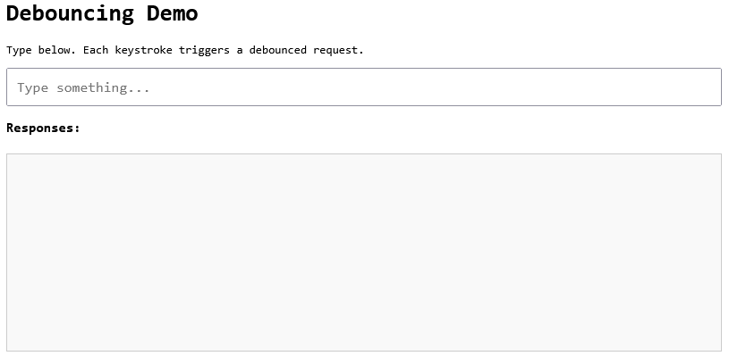

# 你的防抖在欺骗你

> 原文: [Your Debounce Is Lying to You](https://blog.gaborkoos.com/posts/2026-03-28-Your-Debounce-Is-Lying-to-You/)
> 作者: Gabor Koos | 2026年3月28日

*入选 [TLDR Dev - 2026-03-30](https://tldr.tech/dev/2026-03-30)*

[防抖](https://www.geeksforgeeks.org/javascript/debouncing-in-javascript/) 是每个前端开发者很早就学会并一直使用的模式之一。

防抖的核心功能就是把一件事做好：它将爆发式的一连串调用合并为一次静默窗口后的执行。这非常适合嘈杂的 UI 信号。

它最广为人知的用例是自动补全，但同样的模式也适用于 resize 处理器、滚动监听器、实时校验、筛选控件和遥测钩子。

一个典型的实现如下：

```js
function debounce(fn, delay) {
	let timer;
	return (...args) => {
		clearTimeout(timer);
		timer = setTimeout(() => fn(...args), delay);
	};
}

const search = debounce(async (q) => {
	const res = await fetch(`/api/search?q=${q}`);
	const data = await res.json();
	render(data);
}, 300);
```

它看起来有章可循，感觉高效，部署迅速。

而这正是一开始标题的来源。

问题不在于防抖本身。问题在于，一旦真实的网络行为进入画面，这种原生的防抖 + `fetch` 模式就会暴露缺陷。

它给人一种请求"尽在掌控"的感觉，但它并没有控制请求的生命周期：响应顺序、过期工作的取消，或失败行为。

这就是为什么在生产环境中防抖给人一种在"欺骗"的感觉：UI 看起来流畅了，而网络层仍然脆弱。

在本文中，我们将让防抖做它擅长的事（UI 平滑），然后通过取消、重试和更好的错误处理来加固请求路径。

---

## "修复"了的假象

防抖很有说服力：你快速输入，UI 触发的调用更少，网络面板看起来更安静。让人感觉系统现在稳定了。但在生产环境中，在真实的网络条件下，很多事情都可能出错。你会遇到过期数据、浪费的请求、静默失败和其他意外行为。

这对任何网络请求都是如此，但防抖增加了另一层复杂性：它让 UI 看起来很流畅，而网络仍然不可预测。这种不匹配可能造成一种虚假的安全感。

防抖自身只保证一件事：

> "我不会太频繁地调用这个函数。"

防抖平滑的是输入频率，而不是请求生命周期。它并**不**保证：

- 响应按顺序到达。
- 过期的请求停止执行。
- 失败能被一致地处理。

换句话说：它**是一个 UI 模式，而不是一个网络模式**。因此，你必须确保底层的网络层足够健壮，能够应对现实世界的条件。在检查可能出错的问题之前，让我们先搭好舞台！

---

## 配套代码

为了让这些问题可见，我们有一个配套的演示应用，它包含一个文本输入框，每次按键都会触发一个防抖请求到 `/api/echo?q=<input>`。后端是一个 Express 服务器，返回 `{ query, timestamp }`，前端将每个响应追加到一个 div 中显示为 `query@timestamp`。技术栈极简：后端用 Node.js + Express，浏览器中用纯 HTML/CSS/JavaScript。

克隆仓库并安装依赖：

```bash
git clone https://github.com/gkoos/article-debouncing.git
cd article-debouncing
npm install
```

然后启动应用：

```bash
npm start
```

在浏览器中打开 http://localhost:3000。你会看到类似这样的界面：



现在，当你在输入框中输入时，你会看到响应出现在下面的列表中：


UI 还会为请求成功和失败显示 toast 通知，这在后面的章节中会用到。

这是我们基线设置，演示了基本模式。输入有 300ms 防抖，后端立即返回查询内容和时间戳。UI 将每个响应追加到列表中。

---

## 问题 1：竞态条件（即过期 UI）

在你的本地机器上，一切又快又流畅。但在生产环境中，网络条件是不可预测的。请求可能需要不同的时间才能完成，因此无法保证响应会按发送顺序到达。让我们看看如果我们给服务器响应添加随机延迟来模拟真实网络条件会发生什么。

切换到 `01-stale-requests` 分支并重启服务器：

```bash
git checkout 01-stale-requests
npm start
```

我们添加了一个中间件，为每个请求引入 0-1000ms 的随机延迟。现在，当你快速输入时，你可能会看到响应乱序到达：


我们输入了 `12345678`，但 UI 显示的是 `1234567`！`7` 的响应在 `8` **之后**才回来，所以 UI 现在是过期的。这是一个经典的竞态条件，防抖本身并不能阻止它。UI 显示的是旧查询的结果，这在真实应用中可能导致混淆和错误。

如何修复？我们需要确保只有最新请求的响应被处理，而所有之前的请求要么被取消，要么被忽略。我们可以实现一个简单的版本，通过跟踪最新的查询并忽略不匹配的响应。但这仍然会让所有请求都执行完毕，这是低效的。更好的方法是使用 [`AbortController`](https://developer.mozilla.org/en-US/docs/Web/API/AbortController) API 来取消过期的请求，这样它们就不会在完成时消耗资源或触发副作用。

`AbortController` 是一个浏览器原生 API。你创建一个控制器，将其 `signal` 传给 `fetch`，并在任何时候想要取消请求时调用 `abort()`。fetch 会抛出一个 `AbortError`，你可以捕获它并忽略，因为这是预期的行为。

以下是带取消功能的更新版防抖回调：

```js
let controller;

const debouncedFetch = debounce(async (q) => {
  if (!q) return;

  if (controller) controller.abort();
  controller = new AbortController();

  try {
    const response = await fetch(`/api/echo?q=${encodeURIComponent(q)}`, {
      signal: controller.signal
    });
    const data = await response.json();
    // 渲染数据...
  } catch (err) {
    if (err.name === 'AbortError') return;
    // 处理真正的错误...
  }
}, 300);
```

改变了两件事：

- 每次请求之前，我们中止前一次调用中任何正在进行的请求，并创建一个新的控制器。
- 捕获错误后，我们检查是否为 `AbortError`，如果是则提前返回：这些错误是预期的，不是真正的失败。

结果：在正常流程中，一次输入爆发中只有最后一个请求会完成。之前的请求在网络层面就被取消，而不是事后才被忽略。（为了绝对安全，你还可以用请求 ID 检查来保护渲染步骤。这覆盖了一个微小的边缘窗口：即某个请求恰好在较新的请求中止前一个请求的同时完成。）

---

## 问题 2：网络故障

网络不仅在延迟方面不可预测，在可靠性方面也是如此。有时一个请求如果重试可能就会成功，但仍会失败。这可能是由于瞬态服务器问题，如网络拥塞、负载暂时激增或数据库超时。如果我们想要更健壮的用户体验，我们需要优雅地处理这些失败。

让我们在后端模拟随机故障。切换到 `02-failures` 分支并重启服务器：

```bash
git checkout 02-failures
npm start
```

这个版本的服务器添加了随机故障机制：每个请求有 40% 的概率以 500 错误失败。这可能过于激进，但它会帮助我们看清问题。当你在输入框中输入时，你会看到一些请求失败：


嗯，这不太好。首先，当请求失败时，我们的 UI 显示 `undefined@undefined`。这是因为服务器在 500 错误时返回 `{ error: 'Internal Server Error' }`，所以 `data.query` 和 `data.timestamp` 都是 `undefined`。原生 `fetch` 在 HTTP 错误状态码时不会抛出异常：它仅在网络故障时拒绝。因此我们需要自己检查 `response.ok`：

```js
const response = await fetch(`/api/echo?q=${encodeURIComponent(q)}`, {
  signal: controller.signal
});
if (!response.ok) throw new Error(`HTTP ${response.status}`);
const data = await response.json();
```

现在，500 错误在我们接触到响应体之前就抛出异常，`catch` 处理它，错误 toast 会显示出来，而不是出现损坏的输出。

但这只是开始。在真正的应用中，你会希望对瞬态失败实现一些重试逻辑。例如，你可以自动重试失败的请求最多 3 次，使用指数退避。这样，如果请求因临时问题而失败，它就有机会成功，而无需用户做任何操作。

要手动实现这个，你需要编写重试循环、跟踪尝试次数、实现退避计时，并确保在取消后所有这些都不会被触发。这并不简单，而且也不是你应用中最有趣的部分，所以让我们用一个库吧。

`@fetchkit/ffetch` 是一个围绕 `fetch` 的轻量封装，专门处理这类问题。我们将在演示中使用它来处理重试行为。

这方面有一些不错的替代品（例如 `ky`、`axios` 或自定义封装）。我在这里选择 `ffetch` 是因为它保持 `fetch` 兼容的 API 接口，并且干净地处理感知取消的重试。

由于这是一个没有构建步骤的最小演示，我们直接从 CDN 加载它，而不是安装。在真正的项目中你会 `npm install @fetchkit/ffetch` 并正常导入，但这里一行 import 就够了：

```js
import { createClient } from 'https://esm.sh/@fetchkit/ffetch';

const api = createClient({
  retries: 3, // 失败时最多重试 3 次
  shouldRetry: (ctx) => ctx.response?.status >= 500, // 只在 5xx 错误时重试
});
```

`api` 的调用签名与 `fetch` 完全相同：相同的参数，相同的返回类型。你可以直接替换使用：

```js
const response = await api(`/api/echo?q=${encodeURIComponent(q)}`, {
  signal: controller.signal
});
```

在这种特定场景下，这给我们带来了什么：

- **`retries: 3`**——如果服务器返回 500，ffetch 在放弃之前最多重试 3 次
- **`shouldRetry`**——我们只在 5xx 时重试；其他任何情况（网络错误、中止）会立即传播
- **感知取消的退避**——如果在重试间隔期间 `controller.abort()` 被触发，等待会立即退出，中止信号传播；不会有过期工作在后台继续运行

最后一点在这里非常方便。没有它，在重试中途中止请求会切断活跃的 fetch，但退避计时器仍在运行，然后计时器会触发另一个 fetch 尝试，而这个尝试又会立即被中止。现在我们正确处理了。

还有一件事我们可以清理。由于原生 `fetch` 不会在 HTTP 错误状态码时抛出（该 API 的痛点之一），我们不得不添加手动检查：

```js
if (!response.ok) throw new Error(`HTTP ${response.status}`);
```

`ffetch` 也可以处理这个。使用 `throwOnHttpError: true` 配置选项，任何 HTTP 错误响应都会自动抛出，无需手动检查。

```js
const api = createClient({
  retries: 3,
  shouldRetry: (ctx) => ctx.response?.status >= 500,
  throwOnHttpError: true,
});
```

现在 fetch 调用就只是：

```js
const response = await api(`/api/echo?q=${encodeURIComponent(q)}`, {
  signal: controller.signal
});
const data = await response.json();
```

`catch` 块仍然处理所有情况——HTTP 错误、网络故障、真正的错误——而不需要在正常路径中添加任何额外的分支。

最终实现可以在 `03-fixed` 分支找到：

```bash
git checkout 03-fixed
npm start
```

作为参考，使用 `ffetch` 的防抖回调完整代码可以在[这里](https://github.com/gkoos/article-debouncing/blob/03-fixed/src/public/index.html)找到。

---

## 结论

问题不在防抖本身。问题在于把防抖当作网络控制的完整解决方案，而它只处理了其中一个维度：调用频率。对于平滑嘈杂的 UI 信号，它是一个非常有用的模式，但它并不能处理真实网络行为的复杂性。要构建一个健壮的应用，你需要用恰当的请求生命周期管理来补充防抖：取消过期请求、使用退避重试处理瞬态失败，以及一致地处理错误。这样，即使在不可预测的网络条件下，你也能确保 UI 不仅保持响应迅速，而且保持准确。

顺便一提，防抖经常与[节流](https://www.geeksforgeeks.org/javascript/javascript-throttling/)一起讨论，讽刺的是，你的节流也在[欺骗你](https://blog.gaborkoos.com/posts/2026-03-31-Your-Throttling-Is-Lying-to-You/)。就像[你的 HTTP 客户端在欺骗你](https://blog.gaborkoos.com/posts/2026-04-19-Your-HTTP-Client-Is-Lying-to-You/)一样。

上面提到的取消角度比表面看起来要深刻得多。如果你想知道为什么在 JavaScript 中停止异步工作真的很难——不仅仅针对防抖，而是任何异步操作——请看 [JavaScript 中的取消：为什么比看起来更难](https://blog.gaborkoos.com/posts/2025-12-23-Cancellation-In-JavaScript-Why-Its-Harder-Than-It-Looks/)。当防抖与流式数据或 fetch 管道交互时，[JavaScript 中的背压：流、Fetch 和异步代码背后的隐藏力量](https://blog.gaborkoos.com/posts/2026-01-06-Backpressure-in-JavaScript-the-Hidden-Force-Behind-Streams-Fetch-and-Async-Code/) 涵盖了流量控制方面。对于结合了所有这些技术（取消、背压和有界并发）的生产模式，请参阅 [JavaScript 中的高级异步模式](https://blog.gaborkoos.com/posts/2026-01-30-Advanced-Asynchronous-Patterns-in-JavaScript/)。

---

© Gabor Koos | [原文链接](https://blog.gaborkoos.com/posts/2026-03-28-Your-Debounce-Is-Lying-to-You/)
