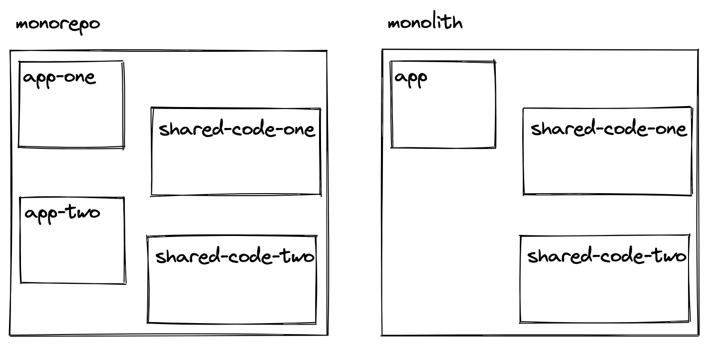
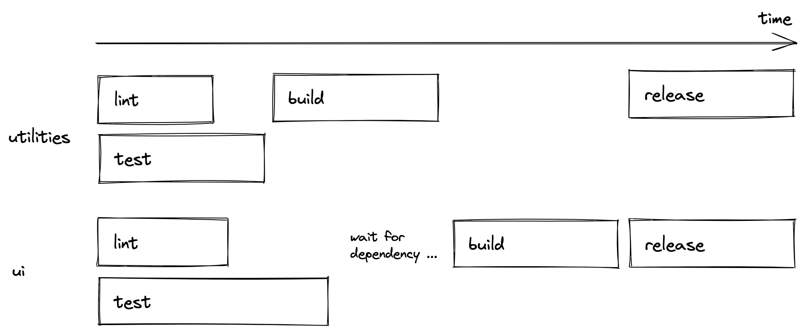

# Monorepos(单体仓库)

# 什么是单体仓库

单体仓库(Monorepo)是一个包含多个较小项目的项目——每个项目可以是独立应用程序，也可以是可复用的包（例如函数、组件、服务）。

术语 "monorepo" 源于 mono（单一）和 repo（仓库）。前者不言自明，后者源于版本控制系统（如 Git），其中项目以 n:n 关系（多仓库/Polyrepo）或 n:1 关系（单体仓库/Monorepo）托管为仓库。

单体仓库常被误认为是单体应用，但它们有本质区别。单体应用指一个紧密集成的单一应用程序，所有功能都存在于一个代码库中。而单体仓库是包含多个独立项目（如应用程序、库或服务）的单一仓库，这些项目保持模块化和独立性，实现资源共享和高效协作，而不会强制整合为单一应用。



# 为什么使用单体仓库

在大型代码库中使用单体仓库有两个显著优势。

- **简化开发并减少开销**
- **促进跨团队和项目的协作**

# 单体仓库的结构

单体仓库可包含多个应用程序（此处：apps），每个应用程序都可以访问共享包集。注意这是单体仓库的一种典型结构，但您开始使用单体仓库时很常见：

```text
my-monorepo
├── apps
├──── app-one
├──── app-two
├── packages
├──── package-one
├──── package-two
├──── package-three

```

包(packages 目录下的文件夹)可以是任何内容：UI 组件(如框架特定)、插件(如 vite 插件)、工具(如实用方法) 或 配置(如 ESLint、TypeScript)等等：

```text
my-monorepo
├── apps
├──── hotel-client
├──── hotel-manager
├── packages
├──── core
├──── http
├──── ui
├──── shared
├──── user
├──── unplugin-cdn
├──── unplugin-wechat

```

_packages_ 中的包可以是另一个包的依赖项。例如，_ui_ 包可能使用 _core_ 包中的函数，因此 _ui_ 包依赖于 _core_ 包。_ui_ 和 _core_ 包都可能使用其他 _shared_ 包的配置。

_apps_ 中的应用程序通常不相互依赖，它们只选择使用 _packages_ 中的包。如果包相互依赖，可以强制执行如“仅当 _core_ 构建成功后才启动 _ui_ 构建”的场景。



由于我们讨论的是 JavaScript/TypeScript 单体仓库，_app_ 可以是 JavaScript 或 TypeScript 应用程序，而只有 TS 应用程序会使用共享的 _ts-config_ 包（或创建自己的配置，或混合使用两者）。

_apps_ 中的应用程序不必使用共享的 _packages_。它们是可选的，可以选择使用自己的 UI 组件、函数和配置的内部实现。但如果 _apps_ 中的应用程序决定使用 _packages_ 中的包作为依赖项，则必须在它们的 _package.json_ 文件中定义：

```json
{
  "dependencies": {
    ...
    "@hc-agent/core": "workspace:*",
    "@hc-agent/http": "workspace:*",
    "@hc-agent/shared": "workspace:*",
    "@hc-agent/ui": "workspace:*",
    "@hc-agent/user": "workspace:*",
    ...
  }
}
```

_apps_ 中的应用程序是独立实体，因此可以是任何应用程序

# 单体仓库工具 (Turborepo)

您已经见证了工作区如何允许我们创建单体仓库结构。但是，虽然工作区使开发人员能够将单体仓库中的项目相互链接，但专用的单体仓库工具带来了更好的开发体验。

当输入：

```sh
pnpm dev
```

从顶级文件夹执行此命令会启动单体仓库中所有在其 `package.json` 文件中定义了 `dev` 脚本的项目。

其他几个命令也是如此，因为它们是在顶层定义的：

```sh
pnpm lint
pnpm build
pnpm clean
```

如果检查顶级 _package.json_ 文件，您会看到一堆总体脚本：

```json
"scripts": {
  "dev": "turbo run dev",
  "lint": "turbo run lint",
  "build": "turbo run build",
  "clean": "turbo run clean",
  ...
},
"devDependencies": {
  ...
  "turbo": "latest"
}
```

名为 [Turborepo](https://turborepo.org/) 的单体仓库工具允许我们定义这些脚本。替代的单体仓库工具有 [Lerna](https://lerna.js.org/) 和 [Nx](https://nx.dev/)。Turborepo 带有多种配置，允许您并行、按顺序或过滤执行其嵌套工作区的脚本：

```json
"scripts": {
  "dev": "turbo run dev --filter=\"docs\"",
  ...
},
```

此外，您将有一个 _turbo.json_ 文件来定义所有脚本的单体仓库流水线。例如，如果一个包在 _packages_ 工作区中有另一个包作为依赖项，那么可以在流水线中为构建脚本定义前者必须等待后者构建完成。


最后，Turborepo 具有本地（默认）和远程文件高级缓存功能。您可以随时选择加入缓存。

# 单体仓库的版本控制 (Changesets)

应用版本，特别是对单体仓库中可能最终出现在包管理器（如 [npm](https://www.npmjs.com/) ）中的共享 _packages_ 来说，并不像预期的那样简单。存在多个挑战，例如 _packages_ 可以相互依赖、需要关注多个包、包是 _packages_ 中的嵌套文件夹，以及每个包必须有自己的变更日志和发布过程。

在单体仓库设置中，_packages_ 的行为类似于依赖项，因为 _apps_ 从工作区设置中使用它们（而不是[npm](https://www.npmjs.com/)）。但是，如果应用程序不想使用工作区中包的最新版本，它可以定义更具体的版本：

```json
"dependencies": {
  "@hc-agent/core": "1.0.0",
  "@hc-agent/http": "1.0.0",
  ...
}
```

在这种情况下，如果工作区中包的版本与指定版本不同，安装脚本将不会使用工作区包，而是使用 Registry 中的包。因此，我们需要一种方法在开发单体仓库时为 _packages_ 创建版本、变更日志和发布。

<Divider />

[changesets](https://github.com/changesets/changesets) 项目是管理多包仓库（如单体仓库）中多个包版本的流行工具。我们的单体仓库设置已经安装了 changesets 。我们将逐步介绍每个 changesets 脚本：

包的版本控制包括将它们发布到 Registry（如 npm）。如果您想继续操作，需要执行以下步骤作为先决条件：

- 在 [npm](https://www.npmjs.com/) 上创建一个允许您发布包的组织
- 在命令行上 npm login
- 在源代码中使用您的组织名称而不是 `hc-agent`
- 使用 `pnpm install && pnpm dev` 验证一切是否仍按预期工作

在我们可以为包添加版本之前的另一个先决条件：我们需要先更改我们的一个 _packages_。进入其中一个 UI 包并更改组件的源代码。之后，任务是将更改反映在发布到 npm 的新版本中。


- 首先，运行 `pnpm changeset`，它允许您为更改的包创建变更日志。提示将引导您选择包（使用空格键）、选择 semver 增量（major、minor、patch）并编写实际的变更日志。之后使用 `git status` 检查仓库，您将看到更改的源代码以及新创建的变更日志文件。如果包相互依赖，链接的包也将获得版本提升。

- 其次，如果变更日志文件没问题，运行 `pnpm changeset version`，它将变更日志和版本应用到实际的包中。您可以再次使用 `git status` 和 `git diff` 检查是否一切如预期。

- 第三，如果一切正常，继续使用 `pnpm release` 将更新的包发布到 npm。发布后，在 npm 上验证您的新版本是否已发布。

本质上，这就是在本地机器上为包添加版本的全部内容。下一节通过使用持续集成进行版本控制（2）和发布（3）步骤，使其对团队更可靠和可扩展。

总之，工作区、Turborepo 和 Changesets 是创建、管理和扩展 JavaScript/TypeScript 单体仓库的完美组合。

单体仓库通过集中管理多个应用程序和包来简化大规模开发，实现无缝协作、简化的依赖项管理和高效更新。pnpm Workspaces、Turborepo 和 Changesets 等工具使单体仓库具有可扩展性和可维护性，为构建和管理复杂项目提供了统一方法。
